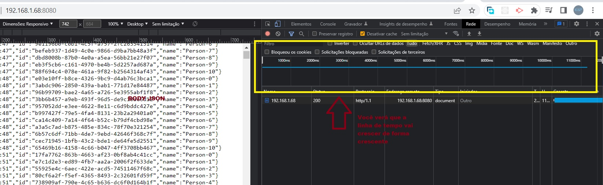

### Node Streams Forçando a continuidade do socket timeout

O Intuito desse código é avaliar o comportamento do socket timeout presente nos clientes WEB Http, forçando a atividade de envio de dados, o que mantém
o socket de comunicação entre servidor e cliente ativos.

#### Executando Aplicação

1 - npm install
2 - npm run server_stream.js
3 - npm run stream:generate
4 - npm run stream:refresh

Abra um navegador, ou qualquer cliente web e faça a requisição para o recurso

<pre>GET http://localhost:8080</pre>

